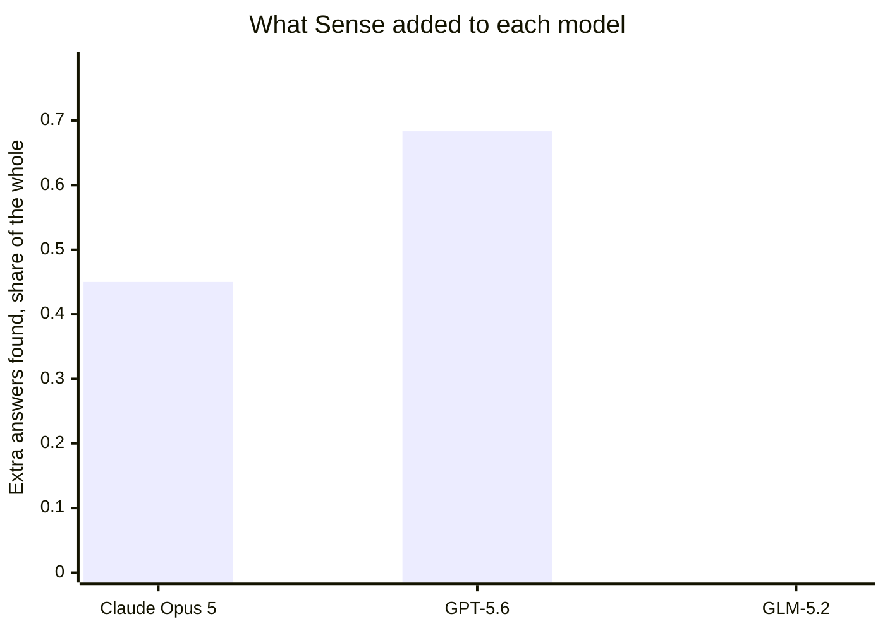
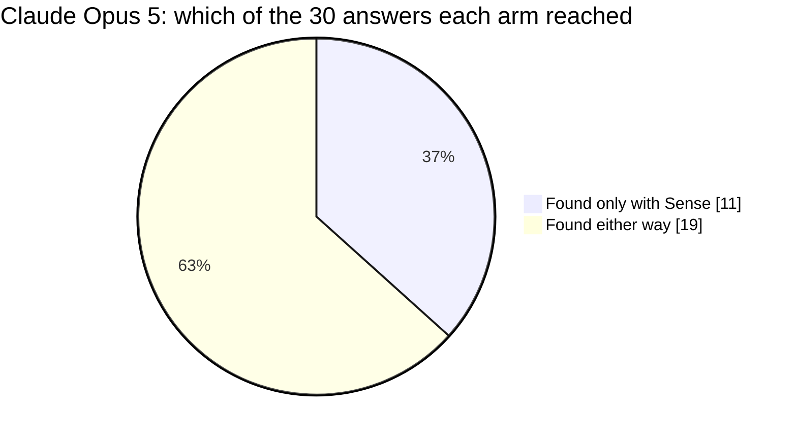
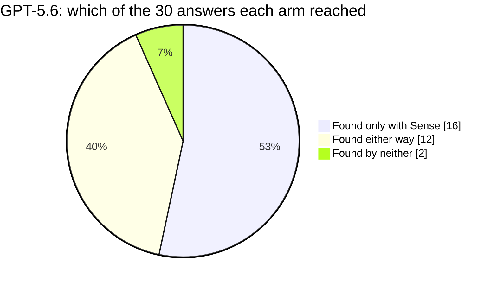
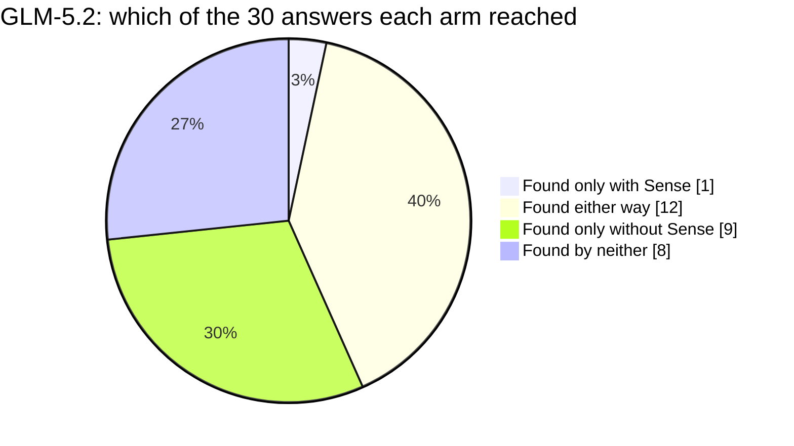
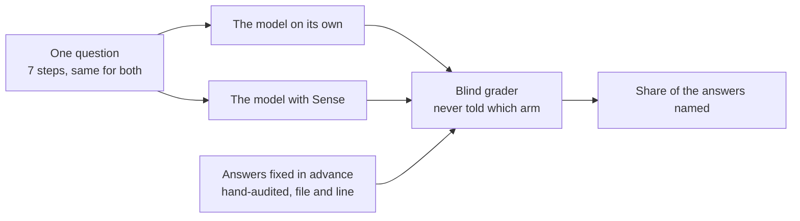

# Does Sense help an AI understand bitwarden-server?

One question about its code, put to 5 models twice each, with Sense and without.

## Reading

On bitwarden-server, Sense put answers in front of models that they never reached without it: 11 of the 30 hand-audited answers for Claude Opus 5, and 16 of 30 for GPT-5.6. It held on the model it was next put to — GPT-5.6, 1 of the 2 models that queried Sense here, cleared the same bar the question was first proved at; Kimi K3 and Mistral Large 3 have not been run yet, so this is a first replication, not a broad one. Every arm that had Sense available did call it, so no column here is a routing failure of ours. Sense costs context rather than clock: Claude Opus 5 moved 359978 tokens working on its own and 494395 with Sense, taking 209.4 seconds against 138.55. The largest gap on this page is GLM-5.2, which scored 0.35 with Sense against its own 0.55 baseline, and where 9 answers it found unaided it did not find with Sense in front of it.

## At a glance

| model | on its own | with Sense | difference | found only with Sense | time with Sense |
|---|---|---|---|---|---|
| Claude Opus 5 | 0.55 | 1.00 | **+0.45** | **11** | 3.5 min |
| GPT-5.6 | 0.20 | 0.88 | **+0.68** | **16** | 5.0 min |
| Kimi K3 | not run | not run | | | |
| GLM-5.2 | 0.55 | 0.35 | **-0.20** | **1** | 4.5 min |
| Mistral Large 3 | not run | not run | | | |

Share of the 30 hand-audited answers each model cited, working the same question. Read each row across, never down: a model is only ever compared to itself.

## The question

A maintainer is about to rework a central class in bitwarden-server and needs to know what depends on it before touching it. The answer is scattered across the codebase, so the work is finding all of it, not reasoning about any one piece.

The class under rework is `IPricingClient` in `src/Core/Billing/Pricing/IPricingClient.cs`.

The models were given no more than this framing, which deliberately never names the class: finding it is part of the task.

> A billing-platform work session on the Bitwarden server, worked in one sitting. The team is about to rework how the application obtains plan pricing: orient, map the piece itself, trace how an answer is obtained and put to use, find everything that would be standing in the way when it changes, trace the guards around it, rank the risk, and hand over the change map. Each step is worked with the budget the previous ones cost.

The session is 7 steps, sent in order. Verbatim:

The full task, exactly as each model received it

**1. Orient in the codebase**

> Task: orient yourself. In a few sentences plus file:line references, what is this project, how is the code deployed and split up, and where does the money side of it sit - the part that has to know what a customer is entitled to before anything else can decide what it is allowed to do? Say which of the pieces you point at are abstractions the rest of the code asks through and which are the things standing behind them. Hand the next agent a map so they can act with small, targeted lookups, not a fresh exploration of the codebase. No Explore agents.

**2. Map the plan-pricing contract**

> Task: orient, and be thorough - the rest of the ticket is built on this. Find where the thing that answers "what does this plan cost and what does it include" is declared as an abstraction, what its one implementation actually does to produce an answer, and how that implementation is wired into the application at start-up - including where it is told to look and what is done to it when the deployment has not been told anywhere to look. Then follow what a caller gets back on a deployment that cannot reach the source at all, and how that differs between the two ways of asking. For each of those give the file:line, the name of the member or routine it lives in, and one phrase on what it contributes. Then say, in a few sentences, what a rework that made this piece fail loudly where it currently answers with nothing would have to preserve. A place named without the routine it lives in does not count, and neither does a routine named without the file:line where it is defined.

**3. Trace how an answer is obtained and put to use**

> Task: follow one answer end to end. Start where what arrives from outside is turned into the shape the rest of the code actually works with - that translation is a step of its own and it decides what the rest of the code is even able to see - and carry on to the places that take an answer and act on it, changing what a customer is paying or what they are allowed to have. For each stage give the file:line and the name of the member or routine it lives in. Then mark each one: does it run inline, inside the request that asked for it, or later and out of band, driven by something that reaches the system on its own after the fact? Say what the out-of-band ones are handed to work from, because a rework has to keep that working, and say what an answer that arrived a moment later or slightly different would do to each stage.

**4. Audit every dependent of the plan-pricing contract**

> Task: this is the core of the ticket, and you are working it with the budget the first part already cost you. Widen back out from the piece you just mapped. The places that ask it for something directly are not what you owe - they say its name out loud, they are one lookup away, and the ticket does not turn on them. What you owe is the ring behind those: every place that would be holding a live one of these at runtime while never naming it, never importing it, and never naming anything related to it. The tie is made at one remove and it is made by a slot, not by a call: such a place declares a field for exactly one collaborator abstraction, and the single thing standing behind that abstraction is itself built around the piece you mapped - so what carries the dependency is which type sits in that slot, and that fact is stated on no line anywhere in that place's file. The collaborator's own name will not hint at what it is fronting, so you cannot get there by reading names. Find every such place. For each one give the file:line of the declaration that creates the hold, name the type that declaration sits in and the intermediary it declares, say which concrete thing is standing behind that intermediary, and say in one phrase what that place would be exposed to if the piece you mapped started failing or answering differently underneath it. Listing intermediaries by themselves is not the answer - an intermediary only says a hop exists, and the ticket turns on who is left holding the far end. A file:line with nothing named around it does not count, one you cannot state the intermediary and the thing behind it for does not count, and a missed one is an outage nobody predicted.

**5. Trace the guards on the answer**

> Task: work all over this codebase acts on what the piece you mapped hands back, and some of what it hands back is not usable - nothing came back at all, or something came back that is no longer one a customer may be put on. Trace how the code satisfies itself, before it acts, that what it is holding is a real and still-current answer: where the empty case is told apart from a deployment where empty is simply what is expected, where an empty answer is turned into a refusal the caller can report rather than an error further down, and where an answer that exists but has been retired is stopped from being acted on. Give the file:line and the enclosing routine for each guard, say in one phrase what it is protecting the caller from, and say where the same guard has been written more than once rather than shared.

**6. Assess the blast radius of the contract change**

> Task: you are about to change what this piece hands back. Assess the full blast radius across everything you have found: which dependents are at risk, which are most likely to break, and what must be re-verified afterwards. Rank by risk and say what drives the ranking - separate the ones that would fail loudly and immediately, at build time or on the first request, from the ones that would keep running and quietly behave differently, which are the expensive ones. Use file:line throughout and name the type or routine that carries each risk, not just the file it is in. A missed high-risk dependent is the one that pages someone.

**7. Produce the change + verification map**

> Task: produce the complete map for landing this safely: the parts of the piece itself you will edit, every dependent that has to be reviewed or touched grouped by area, and the tests that would have to be updated or added to cover the behaviour that moves. Use file:line and the enclosing type or routine throughout, so a teammate could land the change from your map alone without re-exploring the codebase.

| | |
|---|---|
| repository | [bitwarden-server]() |
| stack | csharp-aspnet |
| answers to find | 30, hand-audited |
| Sense build | sense 1.14.0 (schema v5, embeddings: all-MiniLM-L6-v2-ctx1) |
| question id | `sha256:a4012313daeeb8e9` |

## Model by model

### Claude Opus 5

Anthropic's Claude Opus 5, run through Claude Code.

**11 of the 30 answers this model never found on its own**, in either run without Sense, it found with Sense.

Sense put 23.5 of the 30 answers in front of it with exact locations, and the model used them. 6.5 it reached on its own, by opening and searching files rather than from a Sense result, so Sense did not shorten that part of the work.

- **on its own** 0.5500  ->  **with Sense** 1.0000   (**+0.4500**)
- **hardest group of answers** +0.7500
- **where the answers came from** Sense and used 23.5, Sense but unused 0, found without Sense 6.5, reached by neither 0
- **time** 2.3 min on its own, 3.5 min with Sense
- **tokens used** 359,978 on its own, 494,395 with Sense (everything the session moved, cached context included)
- **how it worked** 8 searches and 0 file reads on its own; 4 Sense calls, 8 searches and 0 file reads with Sense
- **time allowed** 480s with Sense, 254s without, the second derived from the first so the question is "given the time it takes WITH Sense, can you get there without it"
- **runs** 2 without Sense, 2 with, carried over from the run that first proved this question

Across this model's runs, 1 answers came back from Sense one time and not the other. We track that as a determinism issue and it is ours to close.

### GPT-5.6

OpenAI's GPT-5.6, run through the Codex CLI.

**16 of the 30 answers this model never found on its own**, in either run without Sense, it found with Sense.

Sense put 24.5 of the 30 answers in front of it with exact locations, and the model used them.

- **on its own** 0.2000  ->  **with Sense** 0.8833   (**+0.6833**)
- **hardest group of answers** +0.9688
- **where the answers came from** Sense and used 24.5, Sense but unused 2.5, found without Sense 2, reached by neither 1
- **time** 5.3 min on its own, 5.0 min with Sense
- **tokens used** 206,046 on its own, 616,700 with Sense (everything the session moved, cached context included)
- **how it worked** 11 searches and 0 file reads on its own; 14 Sense calls, 4 searches and 0 file reads with Sense
- **time allowed** 600s with Sense, 356s without, the second derived from the first so the question is "given the time it takes WITH Sense, can you get there without it"
- **runs** 2 without Sense, 2 with, benched for this board

Across this model's runs, 6 answers came back from Sense one time and not the other. We track that as a determinism issue and it is ours to close.

### Kimi K3

Moonshot AI's Kimi K3 coding model, run through opencode.

Not run for this board yet.

### GLM-5.2

Z.ai's GLM-5.2, run through opencode.

**1 of the 30 answers this model never found on its own**, in either run without Sense, it found with Sense.

15.5 were reached by neither: Sense did not return them and the answer did not name them. Sense put 9 of the 30 answers in front of it with exact locations, and the model used them.

- **on its own** 0.5500  ->  **with Sense** 0.3500   (**-0.2000**)
- **hardest group of answers** +0.0000
- **where the answers came from** Sense and used 9, Sense but unused 4, found without Sense 1.5, reached by neither 15.5
- **time** 4.0 min on its own, 4.5 min with Sense
- **tokens used** 3,380,022 on its own, 1,318,126 with Sense (everything the session moved, cached context included)
- **how it worked** 26 searches and 54 file reads on its own; 8 Sense calls, 15 searches and 34 file reads with Sense
- **time allowed** a fixed ceiling for both arms (opencode: the larger of 1200s, or 3000s for Kimi, and the repo's own)
- **runs** 2 without Sense, 2 with, benched for this board

Across this model's runs, 12 answers came back from Sense one time and not the other. We track that as a determinism issue and it is ours to close.

### Mistral Large 3

Mistral AI's Mistral Large 3, run through opencode.

Not run for this board yet.

## Does it hold across models

1 of the 2 models that actually queried Sense cleared the same bar the question was proved at: **GPT-5.6**.

*Not run yet:* Kimi K3, Mistral Large 3.

## What this is, and what it is not

This is a measurement of **Sense**, run on one question against one repository, with each model answering twice with Sense available and twice without.

It is **not a comparison of the models**. Each one runs on its own harness with its own budget and its own defaults, so their scores are not comparable to each other and are never presented that way here.

**The arms are not all given the same clock**, and each column says what it got. The Claude harness runs Sense first and then gives the no-Sense arm the time Sense took plus a margin, which asks whether the same ground is reachable without the tool. The other harnesses give both arms one fixed ceiling, and that ceiling is larger. A longer clock helps the arm WITHOUT Sense, so those columns are the harder test, not the easier one.

It is **not a comparison of the repositories** either. Questions are written per repository and hand-audited per repository; a number from one page does not rank against a number from another.

How a number here is produced:

The answers were fixed in advance: 30 locations, audited by hand before any model ran, and a model is credited only when it names the file and the line. Grading is done by a separate pinned model that is never told which arm or which model produced an answer.
