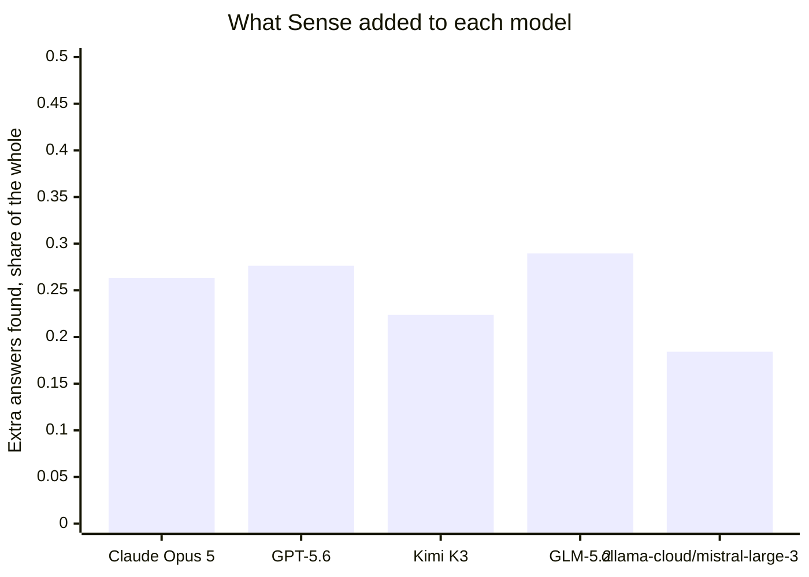
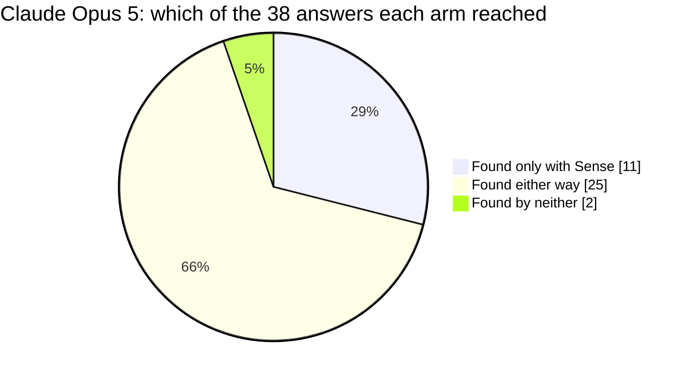
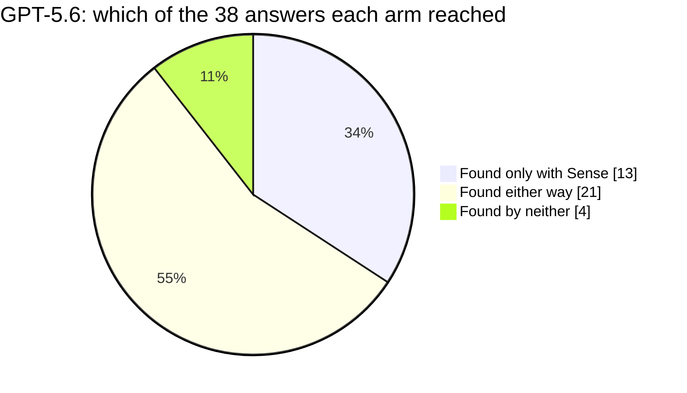
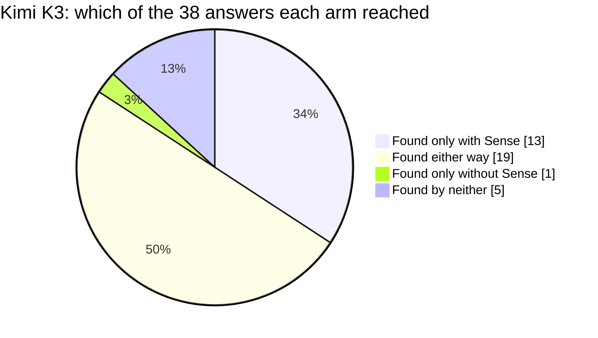
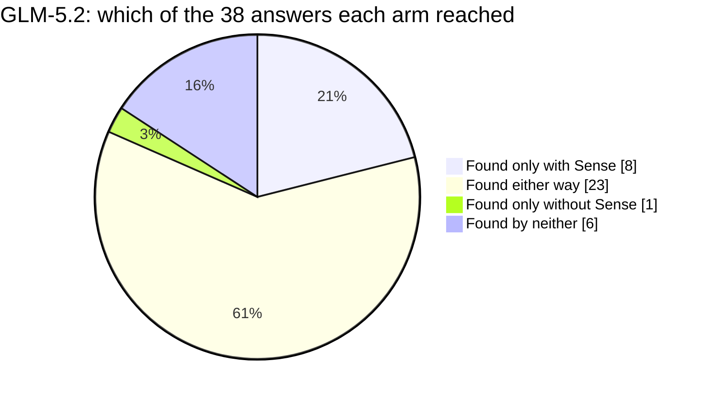
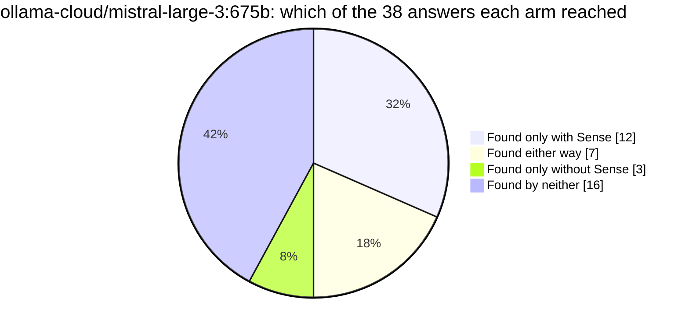
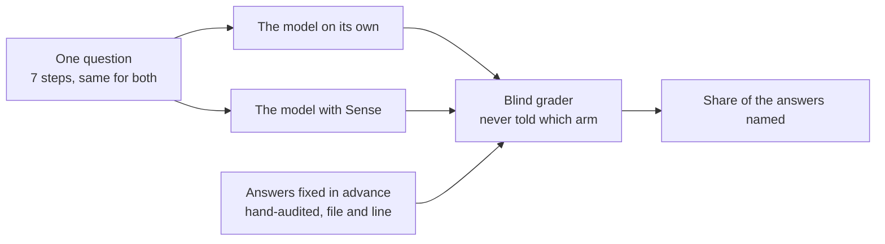

# Does Sense help an AI understand Chatwoot?

Chatwoot: the open-source customer engagement suite, a self-hosted alternative to Intercom and Zendesk. One question about its code, put to 5 models twice each, with Sense and without.

## Reading

With Sense, Claude Opus 5 named 11 of Chatwoot's 38 hand-audited locations that it never reached in either run without it; across all 5 models that figure ran from 8 to 13. Every model offered Sense actually called it, so no column here is a routing failure on our side. It did not cost more to run either: on the headline column the session moved 2,394,712 tokens without Sense and 1,748,326 with it, taking 6.9 minutes against 7.1. The gap the page shows is replication - only 1 of the 4 other models cleared the same bar the question was proved at, and 2 of them answered differently enough between their runs that the board will not call them either way.

## At a glance

| model | on its own | with Sense | difference | found only with Sense | time with Sense |
|---|---|---|---|---|---|
| Claude Opus 5 | 0.61 | 0.87 | **+0.26** | **11** | 6.9 min |
| GPT-5.6 | 0.50 | 0.78 | **+0.28** | **13** |  |
| Kimi K3 | 0.53 | 0.75 | **+0.22** | **13** |  |
| GLM-5.2 | 0.33 | 0.62 | **+0.29** | **8** |  |
| ollama-cloud/mistral-large-3:675b | 0.22 | 0.41 | **+0.18** | **12** |  |

Share of the 38 hand-audited answers each model cited, working the same question. Read each row across, never down: a model is only ever compared to itself.

## The question

A maintainer is about to rework a central class in Chatwoot and needs to know what depends on it before touching it. The answer is scattered across the codebase, so the work is finding all of it, not reasoning about any one piece.

The class under rework is `Conversation` in `app/models/conversation.rb`.

The models were given no more than this framing, which deliberately never names the class: finding it is part of the task.

> You are a maintainer about to rework the record that stands for a single back-and-forth
> between a customer and the support team - the one the whole product is organised around,
> that the rest of the system keeps having to ask about. The rework will change what that
> record hands back to the code that asks it questions. Work the steps below in order, in
> one sitting: each one builds on what the last one established, so do not restart your
> exploration at each step. The hard part is not the record itself - it is how far out
> the code that breaks actually sits, and how little the routines in between have to do
> with this record. Throughout, an answer that points at a place must give an exact
> file:line a teammate could jump straight to, plus one phrase on why it matters. A bare
> filename does not count, and a missed dependent is a regression shipped.

The session is 7 steps, sent in order. Verbatim:

The full task, exactly as each model received it

**1. Orient in the codebase**

> Task: orient yourself. In a few sentences plus file:line references, what is this project, how is the code organized, and where does the record that stands for a single back-and-forth between a customer and the support team sit - the one the rest of the system keeps having to ask about - along with the shared pieces its behaviour is assembled from? Hand the next agent a map so they can act with small, targeted lookups, not a fresh exploration of the codebase. No Explore agents.

**2. Map the conversation-record contract**

> Task: orient, and be thorough - the rest of the ticket is built on this. Start with the one part of this record's job that the whole inbound-mail side leans on: getting hold of the right one of these when a message arrives from outside and all the system holds are the headers that came with it. Trace that path end to end. Show where an arriving message is decided to belong to this path at all, the piece that runs the candidate matches in order, each separate way a match is attempted and what identifier it keys off, the fallback that starts a fresh record when none of them matched, and the point where a record that was only prepared is finally made permanent. For each one give the file:line, the name of the routine it lives in, and one phrase on what it contributes to that path. Then say, in a few sentences, what a rework would have to preserve for that path to keep working. A place named without the routine it lives in does not count, and neither does a routine named without the file:line where it is defined.

**3. Trace how one of these records is created and taken apart**

> Task: trace the lifecycle, building on the map you already have. Follow one of these records from the point where the system decides it needs one it does not have yet, through it being brought into existence and later changed, and on to the point where it is removed again, and say what runs around each of those moments. Something is told every time one of these appears or changes; find the piece that does the telling, and show that it hands the news on along two different routes at once. For every layer give the file:line and the name of the routine it lives in, and mark which parts run inline, in the request that triggered them, and which are handed off to run later in the background. Where something is handed off, say what it is handed the record by - the record itself, or something it can be looked up from again - because that is what a rework of the contract has to keep working.

**4. Audit every dependent of the conversation-record contract**

> Task: this is the core of the ticket, and you are working it with the budget the first part already cost you. Widen back out from that one path to the record class as a whole and find the code that would change behaviour once the rework lands. What makes this hard, and what I want you working at, is DISTANCE. Some of what breaks sits right up against the record. Most of it does not: it asks something else, and that thing asks something else again, and only the last link in the chain ever goes near the record. Chains that long are ordinary here, and the links in the middle are named after jobs that have nothing to do with this record at all, so following one outwards is the whole exercise. So work outwards, link by link, and keep going until the chain runs out - do not stop at the first thing you land on, because the place that actually breaks is usually further out than that. The ones I care about most are the ones furthest out, so lead with those and satisfy yourself you have not stopped short; the near ones are welcome too, they are just not what I am short of. For every place you report, give the exact file:line, then the chain running from that line down to the record - what it asks, what that asks in turn, and so on until something finally reaches the record - how far out it sits, and one phrase on what that place starts getting wrong once the record stops handing back what it hands back today. Be exhaustive across every tree in this codebase, including the ones you would not think to look in twice, and group what you find by area. A bare filename does not count, a place you cannot give the chain for does not count, and a missed dependent is a regression shipped.

**5. Trace the guards that confirm a real, current record**

> Task: work runs against one of these records all over the codebase, and some of what that work is handed is not one at all, or is one the caller is not entitled to act on, or is one whose state has moved on since it was picked up. Trace how the code satisfies itself, before it acts, that what it holds really is one of these and is still a current one it may act on: where an identifier arriving from outside is turned into a record or into a refusal rather than an error further down, where the question of whether this caller may see this one at all is settled, and where code that has been holding one for a while re-checks that the state it decided on is still the state it has. Give the file:line and the enclosing routine for each guard, and say in one phrase what it is protecting the caller from.

**6. Assess the blast radius of the contract change**

> Task: you are about to change what this record hands back. Assess the full blast radius across everything you have found: which dependents are at risk, which are most likely to break, and what must be re-verified afterwards. Rank by risk and say what drives the ranking - separate the ones that would fail loudly and immediately from the ones that would keep running and quietly return something different, which are the expensive ones. Use file:line throughout and name the routine that carries each risk, not just the file it is in. A missed high-risk dependent is the one that pages someone.

**7. Produce the change + verification map**

> Task: produce the complete map for landing this safely: the pieces of the contract itself you will edit, every dependent that has to be reviewed or touched grouped by area, and the tests that would have to be updated or added to cover the behaviour that moves. Use file:line and the enclosing routine throughout, so a teammate could land the change from your map alone without re-exploring the codebase.

| | |
|---|---|
| repository | [Chatwoot](https://github.com/chatwoot/chatwoot) |
| stack | Ruby on Rails |
| answers to find | 38, hand-audited |
| Sense build | sense 1.13.5 (schema v5, embeddings: all-MiniLM-L6-v2-ctx1) |
| question id | `sha256:24f720898c0385b9` |

## Model by model

### Claude Opus 5

Anthropic's Claude Opus 5, run through Claude Code.

**11 of the 38 answers this model never found on its own**, in either run without Sense, it found with Sense.

Sense put 21 of the 38 answers in front of it with exact locations, and the model used them. 12 it reached on its own, by opening and searching files rather than from a Sense result, so Sense did not shorten that part of the work.

- **on its own** 0.6053  ->  **with Sense** 0.8684   (**+0.2632**)
- **hardest group of answers** +0.5769
- **where the answers came from** Sense and used 21, Sense but unused 4, found without Sense 12, reached by neither 1
- **time** 7.1 min on its own, 6.9 min with Sense
- **tokens used** 2,394,712 on its own, 1,748,326 with Sense (everything the session moved, cached context included)
- **how it worked** 40 searches and 0 file reads on its own; 8 Sense calls, 14 searches and 1 file read with Sense
- **time allowed** 480s with Sense, 502s without, the second derived from the first so the question is "given the time it takes WITH Sense, can you get there without it"
- **runs** 2 without Sense, 2 with, carried over from the run that first proved this question

Across this model's runs, 8 answers came back from Sense one time and not the other. We track that as a determinism issue and it is ours to close.

### GPT-5.6

OpenAI's GPT-5.6, run through the Codex CLI.

**13 of the 38 answers this model never found on its own**, in either run without Sense, it found with Sense.

Sense put 21.5 of the 38 answers in front of it with exact locations, and the model used them. 8 it reached on its own, by opening and searching files rather than from a Sense result, so Sense did not shorten that part of the work. 6.5 more were returned by Sense and did not make it into the answer. That one is ours: the information arrived in a shape this model did not carry through.

- **on its own** 0.5000  ->  **with Sense** 0.7763   (**+0.2763**)
- **hardest group of answers** +0.5000
- **where the answers came from** Sense and used 21.5, Sense but unused 6.5, found without Sense 8, reached by neither 2
- **tokens used** 759,120 on its own, 655,622 with Sense (everything the session moved, cached context included)
- **how it worked** 9 searches and 0 file reads on its own; 14 Sense calls, 2 searches and 0 file reads with Sense
- **time allowed** 600s with Sense, 314s without, the second derived from the first so the question is "given the time it takes WITH Sense, can you get there without it"
- **runs** 2 without Sense, 2 with, benched for this board

Across this model's runs, 17 answers came back from Sense one time and not the other. We track that as a determinism issue and it is ours to close.

### Kimi K3

Moonshot AI's Kimi K3 coding model, run through opencode.

**13 of the 38 answers this model never found on its own**, in either run without Sense, it found with Sense.

Sense put 18 of the 38 answers in front of it with exact locations, and the model used them. 10.5 it reached on its own, by opening and searching files rather than from a Sense result, so Sense did not shorten that part of the work. 7.5 more were returned by Sense and did not make it into the answer. That one is ours: the information arrived in a shape this model did not carry through.

- **on its own** 0.5263  ->  **with Sense** 0.7500   (**+0.2237**)
- **hardest group of answers** +0.4231
- **where the answers came from** Sense and used 18, Sense but unused 7.5, found without Sense 10.5, reached by neither 2
- **tokens used** 634,130 on its own, 560,166 with Sense (everything the session moved, cached context included)
- **how it worked** 18 searches and 17 file reads on its own; 2 Sense calls, 12 searches and 8 file reads with Sense
- **time allowed** a fixed ceiling for both arms (opencode: the larger of 1200s, or 3000s for Kimi, and the repo's own)
- **runs** 1 without Sense, 2 with, benched for this board

Across this model's runs, 8 answers came back from Sense one time and not the other. We track that as a determinism issue and it is ours to close.

### GLM-5.2

Z.ai's GLM-5.2, run through opencode.

**8 of the 38 answers this model never found on its own**, in either run without Sense, it found with Sense.

This model's two runs tell different stories, so the board does not call it either way until a third run rules.

- **on its own** 0.3290  ->  **with Sense** 0.6184   (**+0.2895**)
- **hardest group of answers** +0.3571
- **where the answers came from** Sense and used 10, Sense but unused 3.5, found without Sense 13.5, reached by neither 11
- **tokens used** 3,092,954 on its own, 2,019,466 with Sense (everything the session moved, cached context included)
- **how it worked** 27 searches and 48 file reads on its own; 5 Sense calls, 20 searches and 44 file reads with Sense
- **time allowed** a fixed ceiling for both arms (opencode: the larger of 1200s, or 3000s for Kimi, and the repo's own)
- **runs** 2 without Sense, 2 with, benched for this board

Across this model's runs, 28 answers came back from Sense one time and not the other. We track that as a determinism issue and it is ours to close.

### ollama-cloud/mistral-large-3:675b

**12 of the 38 answers this model never found on its own**, in either run without Sense, it found with Sense.

This model's two runs tell different stories, so the board does not call it either way until a third run rules.

- **on its own** 0.2237  ->  **with Sense** 0.4079   (**+0.1842**)
- **hardest group of answers** +0.3846
- **where the answers came from** Sense and used 14, Sense but unused 14.5, found without Sense 1.5, reached by neither 8
- **tokens used** 759,154 on its own, 784,782 with Sense (everything the session moved, cached context included)
- **how it worked** 20 searches and 12 file reads on its own; 14 Sense calls, 0 searches and 10 file reads with Sense
- **time allowed** a fixed ceiling for both arms (opencode: the larger of 1200s, or 3000s for Kimi, and the repo's own)
- **runs** 2 without Sense, 2 with, benched for this board

Across this model's runs, 9 answers came back from Sense one time and not the other. We track that as a determinism issue and it is ours to close.

## Does it hold across models

1 of the 4 models that actually queried Sense cleared the same bar the question was proved at: **GPT-5.6**.

## What this is, and what it is not

This is a measurement of **Sense**, run on one question against one repository, with each model answering twice with Sense available and twice without.

It is **not a comparison of the models**. Each one runs on its own harness with its own budget and its own defaults, so their scores are not comparable to each other and are never presented that way here.

**The arms are not all given the same clock**, and each column says what it got. The Claude harness runs Sense first and then gives the no-Sense arm the time Sense took plus a margin, which asks whether the same ground is reachable without the tool. The other harnesses give both arms one fixed ceiling, and that ceiling is larger. A longer clock helps the arm WITHOUT Sense, so those columns are the harder test, not the easier one.

It is **not a comparison of the repositories** either. Questions are written per repository and hand-audited per repository; a number from one page does not rank against a number from another.

How a number here is produced:

The answers were fixed in advance: 38 locations, audited by hand before any model ran, and a model is credited only when it names the file and the line. Grading is done by a separate pinned model that is never told which arm or which model produced an answer.
