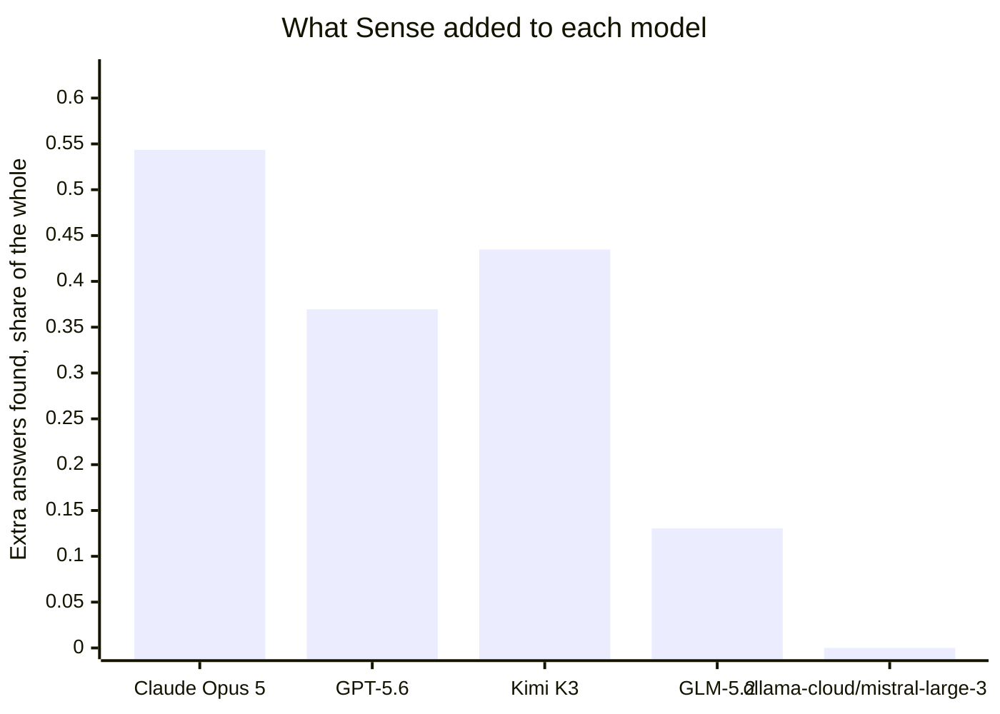
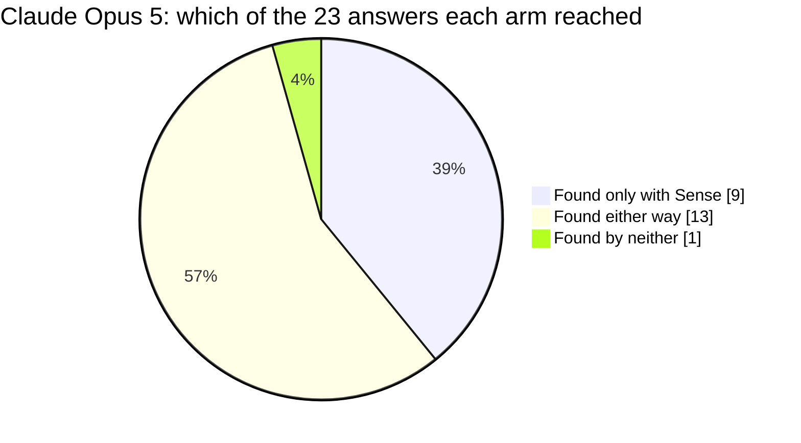
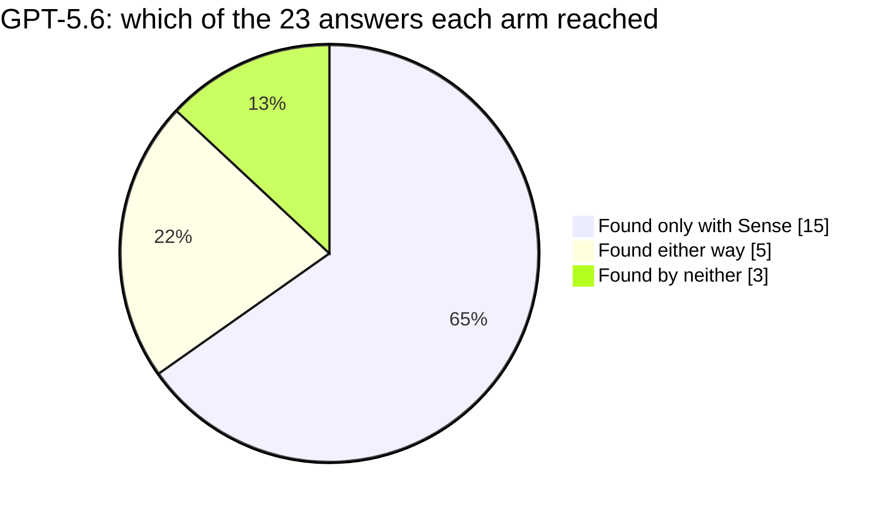
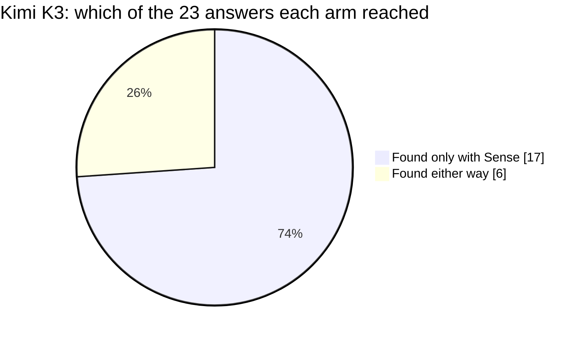
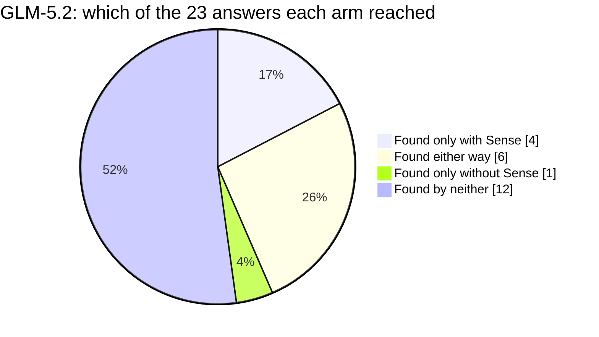
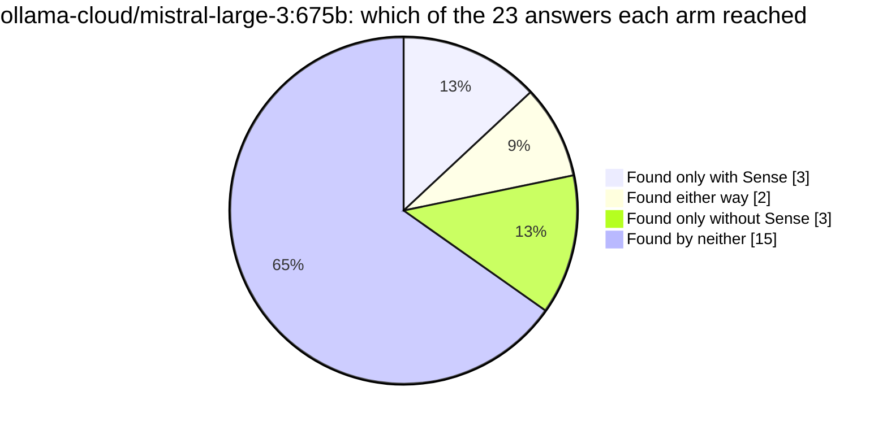
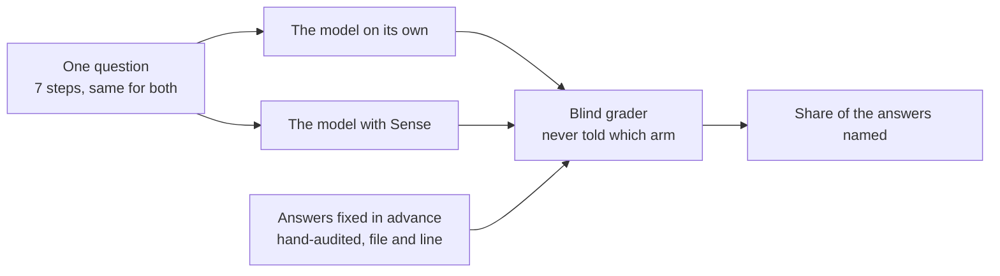

# Does Sense help an AI understand Discourse?

Discourse: the open-source discussion platform that runs a large share of the internet's forums. One question about its code, put to 5 models twice each, with Sense and without.

## Reading

Working one rework ticket on Discourse, Claude Opus 5 named 9 of the 23 hand-audited locations only when it had Sense - answers it reached in neither run without it - which moved it from 0.3696 of the answer set to 0.9131. The same question went to four more models, each on its own harness and each judged only against its own baseline: all four called Sense, and two of them, GPT-5.6 and Kimi K3, cleared the bar the question was proved at. Cost went in both directions on the Claude column, 1,135,647.5 tokens with Sense against 905,453.5 without, and slightly less time on the clock, 332.2 seconds against 339.3. The largest gap on this page is at the bottom of it: ollama-cloud/mistral-large-3:675b queried Sense in both runs and gained nothing, 0.1522 with it and 0.1522 without, with 15 and 17 of the audited answers handed back to it and never carried into what it wrote.

## At a glance

| model | on its own | with Sense | difference | found only with Sense | time with Sense |
|---|---|---|---|---|---|
| Claude Opus 5 | 0.37 | 0.91 | **+0.54** | **9** | 5.5 min |
| GPT-5.6 | 0.17 | 0.54 | **+0.37** | **15** |  |
| Kimi K3 | 0.20 | 0.63 | **+0.43** | **17** |  |
| GLM-5.2 | 0.15 | 0.28 | **+0.13** | **4** |  |
| ollama-cloud/mistral-large-3:675b | 0.15 | 0.15 | **+0.00** | **3** |  |

Share of the 23 hand-audited answers each model cited, working the same question. Read each row across, never down: a model is only ever compared to itself.

## The question

A maintainer is about to rework a central class in Discourse and needs to know what depends on it before touching it. The answer is scattered across the codebase, so the work is finding all of it, not reasoning about any one piece.

The class under rework is `Category` in `app/models/category.rb`.

The models were given no more than this framing, which deliberately never names the class: finding it is part of the task.

> You are a maintainer about to rework the class that represents one of this forum's
> top-level containers - the thing topics are filed under, that carries its own
> permissions, settings and hierarchy, and that half the product reaches for whenever it
> needs to know where something belongs or who is allowed to see it. The rework will change
> what that class hands back to the code that asks it questions, and it will change the
> shape of what it stores. Work the ticket end to end in one session: orient, map the
> contract and the path every incoming request leans on, trace how one of these records is
> built up and taken apart, audit everywhere else in the codebase that would have to be
> reviewed or changed with it, trace the guards that confirm a real and current record,
> rank the blast radius, and finish with the map a teammate could land the change from.
> Throughout, an answer that points at a place must give an exact file:line a teammate
> could jump straight to, plus one phrase on why it matters. A bare filename does not
> count, a set of names offered together with one shared reason and no location on any of
> them does not count, and a missed dependent is a regression shipped. Answer each step
> once and move on: a later step refers back to a place an earlier one already located,
> by name, and never re-lists it. You are being read by a teammate who has your whole
> answer in front of them, so restating a list you have already written is wasted budget
> that a later step needs.

The session is 7 steps, sent in order. Verbatim:

The full task, exactly as each model received it

**1. Orient in the codebase**

> Task: orient yourself, briefly. In a short paragraph plus a handful of file:line references, what is this project, how is the code organized, and where does the class that stands for the container topics are filed under sit - the one the rest of the system keeps having to ask about - along with the shared pieces its behaviour is assembled from? Name only the places the later steps will actually need: this is a map, not a survey, and a tour of the tree costs budget the ticket needs. Hand the next agent a map so they can act with small, targeted lookups, not a fresh exploration of the codebase. No Explore agents.

**2. Map the category contract**

> Task: map the shape of the contract, tightly. Start with the one part of this class's job that every incoming request leans on: getting hold of one of these records when all the system has is the human-readable path the visitor typed, which may name a parent and a child, may be an old path that has since been retired, and may not name one of these at all. Trace that one path end to end, and give the single clearest place that does each job along it: where such a path is turned into one of these records, where the hierarchy is walked to disambiguate one level from another, where the stored path is kept in step when the record is renamed, and where a path that turns out to point somewhere else is redirected or refused. One place per job, one line each: the file:line, the name of the routine it lives in, and one phrase on what it contributes to that path. Do not enumerate every caller of any of them - the ticket's enumeration comes later, and this step is only the map it starts from. A place named without the routine it lives in does not count, and neither does a routine named without the file:line where it is defined.

**3. Trace how one of these records is built up and taken apart**

> Task: trace the lifecycle, briefly. Follow one of these records from being brought into existence to being taken apart again, and say what runs around those two moments. Give the places one of these is created, the place one is destroyed, and the work that runs around them - a few representative places, correctly marked, is the whole answer here, not a catalogue. One line each: the file:line, the name of the routine it lives in, and whether it runs inline, in the request or task that triggered it, or is handed off to run once that call has finished. Where something is handed off, say what it is handed - the record itself, or something it can be looked up from again - because that is what a rework of the contract has to keep working. Do not recite the declarations that register this work; show the code that picks it up.

**4. Audit every dependent of the category contract**

> Task: this is the core of the ticket, and you are working it with the budget the first part already cost you. Widen back out from that one path to the class as a whole, as a single subject, and find EVERY place in the codebase that would have to be reviewed or changed with it, so the rework cannot silently break one. Most of what you are looking for is not doing this class's job at all: it is in the middle of some other job entirely, it reaches for this class exactly once to settle a question that other job needs answered, and the routine it does that from is named after the other job and never after this one. So the answer you owe is not where the dependency sits but WHOSE behaviour changes: for every dependent, name the routine the dependency is inside, give its file:line, and say in one phrase what that routine would start getting wrong if the class stopped handing back what it hands back today. Work it as a closed set, and that is the part being marked. Assemble your candidates first, all of them, before you write any of them up; then go through that list in the order you assembled it and finish each one - routine, file:line, consequence - before you look at the next. The candidate you turned up last is worth exactly what the first one was worth, so do not order the write-up by how interesting or how certain a place is, and do not let the end of the list turn into prose: "and a few similar cases", "other places follow the same pattern", or a closing paragraph that gestures at a remainder is the same as leaving those places out. If you examine a candidate and decide it is not really a dependent, it still gets its file:line and one clause saying why you ruled it out - discarding a place costs you more words than keeping it, on purpose. Finish by reconciling: say how many candidates you assembled and how many you wrote up individually above, and if those two numbers are not the same, list every candidate that is missing, each at its file:line. A file:line with no routine named around it does not count, a routine you cannot state the consequence for does not count, and a missed dependent is a regression shipped.

**5. Trace the guards that confirm a real, current record**

> Task: work runs against one of these records all over the codebase, and some of what that work is handed is not one at all, or names one that is no longer there. Show how the code satisfies itself, before it acts, that what it holds really is one of these and that it really still exists. There are three kinds of guard to cover and ONE example of each is enough - a second example of a kind you have already shown is worth nothing here: an incoming thing checked for being the right kind of thing at all; a name or an identifier that resolves to nothing turned into a refusal at the boundary rather than an error further down; and a reference that was stored earlier re-checked against what is actually there before it is trusted. One line each: the file:line, the enclosing routine, and one phrase on what it protects the caller from.

**6. Assess the blast radius of the contract change**

> Task: you are about to change what this class hands back. Rank the risk. Do NOT re-list what you have already located above - a ranking that repeats the audit back is not a ranking and it costs budget the last step needs. Name only the places most likely to break, in risk order, one line each, and say what puts each where it is: separate the ones that would fail loudly and immediately from the ones that would keep running and quietly return something different, which are the expensive ones. Use file:line and name the routine that carries each risk, not just the file it is in. Then say in a sentence or two what must be re-verified afterwards. A missed high-risk dependent is the one that pages someone.

**7. Produce the change + verification map**

> Task: finish with the map for landing this safely, and again do not repeat the audit back. Three things only: the pieces of the contract itself you will edit, each at its file:line and the routine it lives in; then the areas the dependents fall into, and for each area how many you found there and the one in it you would review first, at its file:line - the area line stands in for the rest, which you have already written out; then the tests that would have to be updated or added to cover the behaviour that moves. A teammate reading this map together with what you have already written should be able to land the change without re-exploring the codebase.

| | |
|---|---|
| repository | [Discourse](https://github.com/discourse/discourse) |
| stack | Ruby on Rails |
| answers to find | 23, hand-audited |
| Sense build | sense 1.13.5 (schema v5, embeddings: all-MiniLM-L6-v2-ctx1) |
| question id | `sha256:1def723310067e48` |

## Model by model

### Claude Opus 5

Anthropic's Claude Opus 5, run through Claude Code.

**9 of the 23 answers this model never found on its own**, in either run without Sense, it found with Sense.

Sense put 19 of the 23 answers in front of it with exact locations, and the model used them.

- **on its own** 0.3696  ->  **with Sense** 0.9131   (**+0.5435**)
- **hardest group of answers** +0.7083
- **where the answers came from** Sense and used 19, Sense but unused 1, found without Sense 2, reached by neither 1
- **time** 5.7 min on its own, 5.5 min with Sense
- **tokens used** 905,454 on its own, 1,135,648 with Sense (everything the session moved, cached context included)
- **how it worked** 20 searches and 0 file reads on its own; 10 Sense calls, 13 searches and 0 file reads with Sense
- **time allowed** 480s with Sense, 403s without, the second derived from the first so the question is "given the time it takes WITH Sense, can you get there without it"
- **runs** 2 without Sense, 2 with, carried over from the run that first proved this question

Across this model's runs, 2 answers came back from Sense one time and not the other. We track that as a determinism issue and it is ours to close.

### GPT-5.6

OpenAI's GPT-5.6, run through the Codex CLI.

**15 of the 23 answers this model never found on its own**, in either run without Sense, it found with Sense.

This model's two runs tell different stories, so the board does not call it either way until a third run rules.

- **on its own** 0.1739  ->  **with Sense** 0.5435   (**+0.3696**)
- **hardest group of answers** +0.5000
- **where the answers came from** Sense and used 12, Sense but unused 8, found without Sense 0.5, reached by neither 2.5
- **tokens used** 775,032 on its own, 546,882 with Sense (everything the session moved, cached context included)
- **how it worked** 14 searches and 0 file reads on its own; 12 Sense calls, 3 searches and 0 file reads with Sense
- **time allowed** 600s with Sense, 256s without, the second derived from the first so the question is "given the time it takes WITH Sense, can you get there without it"
- **runs** 2 without Sense, 2 with, benched for this board

Across this model's runs, 17 answers came back from Sense one time and not the other. We track that as a determinism issue and it is ours to close.

### Kimi K3

Moonshot AI's Kimi K3 coding model, run through opencode.

**17 of the 23 answers this model never found on its own**, in either run without Sense, it found with Sense.

This model's two runs tell different stories, so the board does not call it either way until a third run rules.

- **on its own** 0.1956  ->  **with Sense** 0.6304   (**+0.4348**)
- **hardest group of answers** +0.6250
- **where the answers came from** Sense and used 11.5, Sense but unused 0, found without Sense 3, reached by neither 8.5
- **tokens used** 1,093,852 on its own, 939,008 with Sense (everything the session moved, cached context included)
- **how it worked** 40 searches and 8 file reads on its own; 4 Sense calls, 25 searches and 4 file reads with Sense
- **time allowed** a fixed ceiling for both arms (opencode: the larger of 1200s, or 3000s for Kimi, and the repo's own)
- **runs** 2 without Sense, 2 with, benched for this board

Across this model's runs, 20 answers came back from Sense one time and not the other. We track that as a determinism issue and it is ours to close.

### GLM-5.2

Z.ai's GLM-5.2, run through opencode.

**4 of the 23 answers this model never found on its own**, in either run without Sense, it found with Sense.

This model's two runs tell different stories, so the board does not call it either way until a third run rules.

- **on its own** 0.1522  ->  **with Sense** 0.2826   (**+0.1305**)
- **hardest group of answers** +0.2500
- **where the answers came from** Sense and used 6.5, Sense but unused 5.5, found without Sense 0, reached by neither 11
- **tokens used** 1,048,392 on its own, 1,448,973 with Sense (everything the session moved, cached context included)
- **how it worked** 20 searches and 18 file reads on its own; 6 Sense calls, 23 searches and 28 file reads with Sense
- **time allowed** a fixed ceiling for both arms (opencode: the larger of 1200s, or 3000s for Kimi, and the repo's own)
- **runs** 2 without Sense, 2 with, benched for this board

Across this model's runs, 16 answers came back from Sense one time and not the other. We track that as a determinism issue and it is ours to close.

### ollama-cloud/mistral-large-3:675b

**3 of the 23 answers this model never found on its own**, in either run without Sense, it found with Sense.

16 more were returned by Sense and did not make it into the answer. That one is ours: the information arrived in a shape this model did not carry through. 3.5 were reached by neither: Sense did not return them and the answer did not name them. Sense put 3.5 of the 23 answers in front of it with exact locations, and the model used them.

- **on its own** 0.1522  ->  **with Sense** 0.1522   (**+0.0000**)
- **hardest group of answers** +0.3333
- **where the answers came from** Sense and used 3.5, Sense but unused 16, found without Sense 0, reached by neither 3.5
- **tokens used** 353,590 on its own, 529,650 with Sense (everything the session moved, cached context included)
- **how it worked** 8 searches and 6 file reads on its own; 11 Sense calls, 0 searches and 4 file reads with Sense
- **time allowed** a fixed ceiling for both arms (opencode: the larger of 1200s, or 3000s for Kimi, and the repo's own)
- **runs** 2 without Sense, 2 with, benched for this board

Across this model's runs, 4 answers came back from Sense one time and not the other. We track that as a determinism issue and it is ours to close.

## Does it hold across models

2 of the 4 models that actually queried Sense cleared the same bar the question was proved at: **GPT-5.6**, **Kimi K3**.

## What this is, and what it is not

This is a measurement of **Sense**, run on one question against one repository, with each model answering twice with Sense available and twice without.

It is **not a comparison of the models**. Each one runs on its own harness with its own budget and its own defaults, so their scores are not comparable to each other and are never presented that way here.

**The arms are not all given the same clock**, and each column says what it got. The Claude harness runs Sense first and then gives the no-Sense arm the time Sense took plus a margin, which asks whether the same ground is reachable without the tool. The other harnesses give both arms one fixed ceiling, and that ceiling is larger. A longer clock helps the arm WITHOUT Sense, so those columns are the harder test, not the easier one.

It is **not a comparison of the repositories** either. Questions are written per repository and hand-audited per repository; a number from one page does not rank against a number from another.

How a number here is produced:

The answers were fixed in advance: 23 locations, audited by hand before any model ran, and a model is credited only when it names the file and the line. Grading is done by a separate pinned model that is never told which arm or which model produced an answer.
