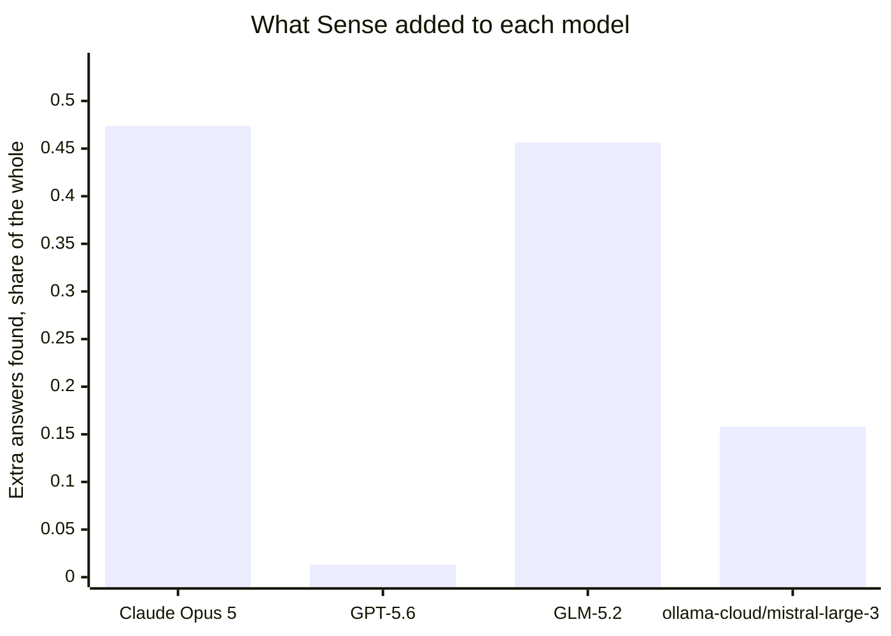
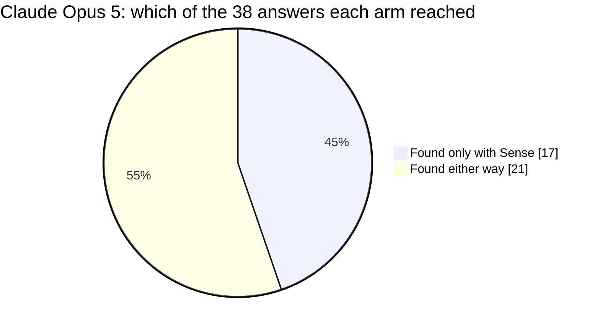
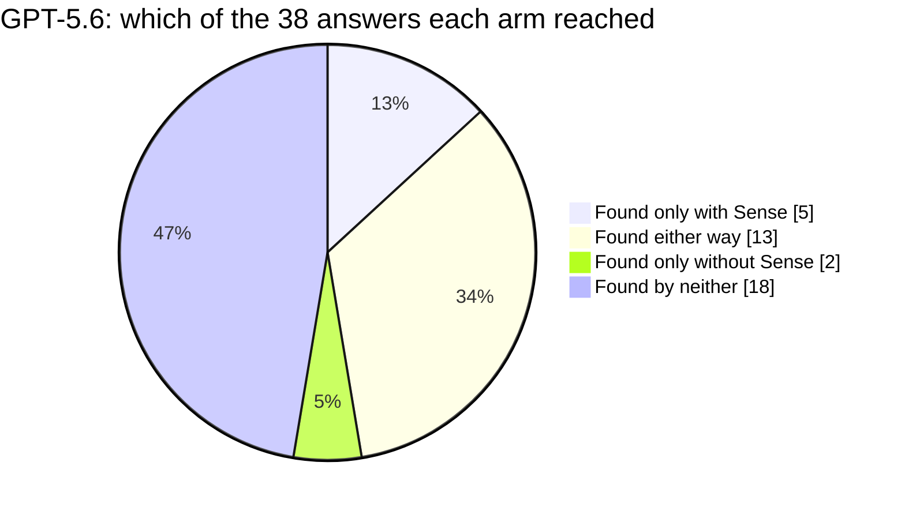
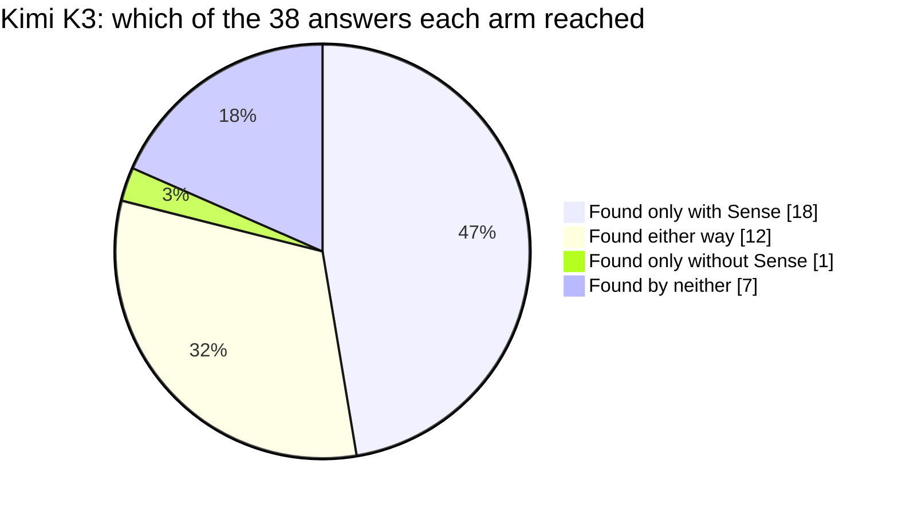
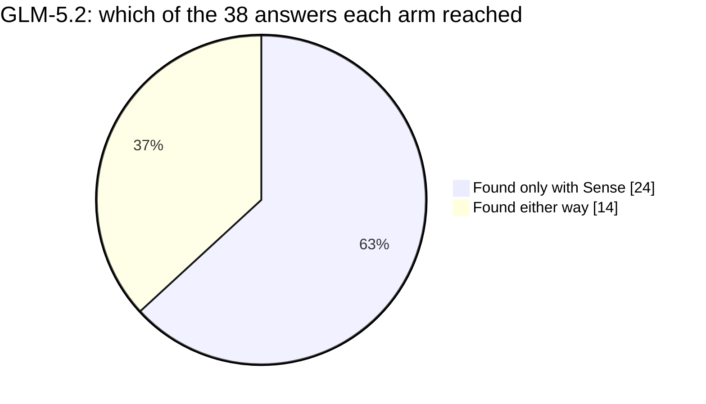
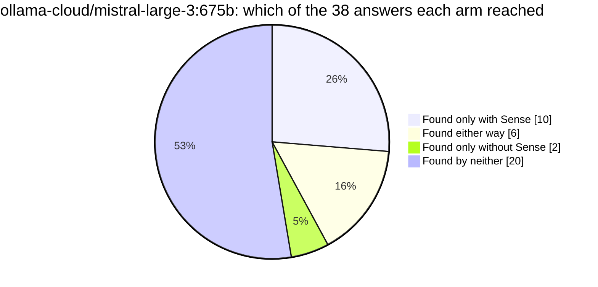
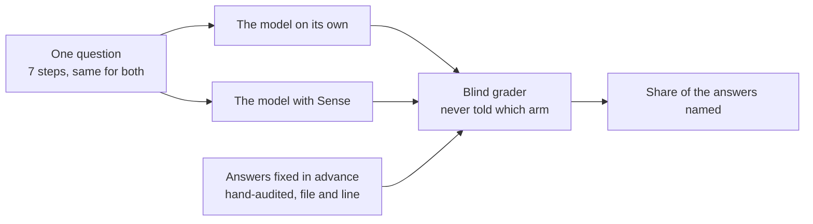

# Does Sense help an AI understand Mastodon?

Mastodon: the decentralised social network server behind the ActivityPub fediverse. One question about its code, put to 5 models twice each, with Sense and without.

## Reading

Asked to find everything in Mastodon that depends on the class standing for a person, Claude Opus 5 named 17 of the 38 hand-audited answers it never reached in either run without Sense, and GLM-5.2 named 24 it never reached on its own. It did not hold everywhere: of the 4 models that queried Sense, 2 cleared the same bar the question was proved at, and one Kimi K3 run never called Sense at all, which is a routing gap on our side rather than anything the model did wrong. Cost moved in both directions — GLM-5.2 spent 1,587,491 tokens working on its own against 769,879 with Sense, while the Mistral arm went the other way and spent 1,548,626 with Sense — and the Claude arm finished in 7.2 minutes with Sense against 8.0 without. The largest gap on this page is GPT-5.6, where Sense returned locations that never made it into what the model wrote and the difference came out at +0.0132; carrying a returned location through to the final answer is our problem to solve.

## At a glance

| model | on its own | with Sense | difference | found only with Sense | time with Sense |
|---|---|---|---|---|---|
| Claude Opus 5 | 0.53 | 1.00 | **+0.47** | **17** | 7.2 min |
| GPT-5.6 | 0.34 | 0.36 | **+0.01** | **5** |  |
| Kimi K3 | 0.34 | 0.79 | +0.45 | | never called Sense |
| GLM-5.2 | 0.18 | 0.64 | **+0.46** | **24** |  |
| ollama-cloud/mistral-large-3:675b | 0.14 | 0.30 | **+0.16** | **10** |  |

Share of the 38 hand-audited answers each model cited, working the same question. Read each row across, never down: a model is only ever compared to itself.

## The question

A maintainer is about to rework a central class in Mastodon and needs to know what depends on it before touching it. The answer is scattered across the codebase, so the work is finding all of it, not reasoning about any one piece.

The class under rework is `Account` in `app/models/account.rb`.

The models were given no more than this framing, which deliberately never names the class: finding it is part of the task.

> You are a maintainer about to rework the class that represents a person on this
> service - the one every other part of the codebase reaches for when it needs to know
> who someone is, whether they are here or on another server. The rework will change what
> that class hands back to the code that asks it questions. Before you touch it you have
> to know how the rest of the system gets hold of one of these when all it has is an
> identifier from outside, how one is built and taken apart again, what confirms it is a
> real and current one before work runs against it, and everywhere else in the codebase
> that would have to change with it. Work through the tasks below one at a time; each
> builds on what you learned in the previous one, and the budget the earlier ones cost you
> is the budget the later ones have left. Throughout, an answer that points at a place must
> say which routine that place is inside, and give an exact file:line a teammate could jump
> straight to, plus one phrase on why it matters. A bare filename does not count, a
> file:line with no routine named around it does not count, and a missed dependent is a
> regression shipped.

The session is 7 steps, sent in order. Verbatim:

The full task, exactly as each model received it

**1. Orient in the codebase**

> Task: orient yourself. In a few sentences plus file:line references, what is this project, how is the code organized, and where does the record that stands for a person sit - the one the rest of the system keeps having to ask about - along with the shared pieces its behaviour is assembled from? Hand the next agent a map so they can act with small, targeted lookups, not a fresh exploration of the codebase. No Explore agents.

**2. Map the account-record contract**

> Task: orient, and be thorough - the rest of the ticket is built on this. Start with the one part of this class's job that the whole federation side leans on: getting hold of one of these records when all the system has is an identifier that arrived from outside, in whatever form the outside world happened to send it. Trace that path end to end. Show every entry point that turns an outside identifier into one of these records, every place along the path that caches or short-circuits it, every place it goes out to the network to build a record it did not have, and every place it hands something else back because the identifier turned out not to be a person at all. For each one give the file:line, the name of the routine it lives in, and one phrase on what it contributes to that path. Then say, in a few sentences, what a rework would have to preserve for that path to keep working. A place named without the routine it lives in does not count, and neither does a routine named without the file:line where it is defined.

**3. Trace how one of these records is built up and taken apart**

> Task: trace the lifecycle. Follow one of these records from the point where the system decides it needs one it does not have yet, through it being brought into existence and later updated, and on to the point where it is put beyond use again - withdrawn, wound down, or folded into another one - and say what runs around each of those moments. For every layer give the file:line and the name of the routine it lives in, and mark which parts run inline, in the request that triggered them, and which are handed off to run later in the background. Where something is handed off, say what it is handed the record by - the record itself, or something it can be looked up from again - because that is what a rework of the contract has to keep working.

**4. Audit every dependent of the account-record contract**

> Task: this is the core of the ticket, and you are working it with the budget the first part already cost you. Widen back out from that one path to the class as a whole, as a single subject, and find EVERY place in the codebase that would have to change with it, so the rework cannot silently break one. Be exhaustive and group them by area. Most of what you are looking for is not doing this class's job at all: it is in the middle of some other job entirely, it reaches for this class exactly once to settle a question that other job needs answered, and the routine it does that from is named after the other job and never after this one. So the answer you owe is not where the dependency sits but WHOSE behaviour changes: for every dependent, name the routine the dependency is inside, give its file:line, and say in one phrase what that routine would start getting wrong if the class stopped handing back what it hands back today. A file:line with no routine named around it does not count, a routine you cannot state the consequence for does not count, and a missed dependent is a regression shipped.

**5. Trace the guards that confirm a real, current record**

> Task: work runs against one of these records all over the codebase, and some of what it is handed is not one at all, or is one that is no longer usable. Trace how the code satisfies itself, before it acts, that what it holds really is one of these and is still a current one: where the incoming thing is checked for being the right kind of thing at all, where a missing one is turned into a refusal rather than an error further down, and where one that exists but has been withdrawn or is not yet cleared is stopped from being acted on. Give the file:line and the enclosing routine for each guard, and say in one phrase what it is protecting the caller from.

**6. Assess the blast radius of the contract change**

> Task: you are about to change what this class hands back. Assess the full blast radius across everything you have found: which dependents are at risk, which are most likely to break, and what must be re-verified afterwards. Rank by risk and say what drives the ranking - separate the ones that would fail loudly and immediately from the ones that would keep running and quietly return something different, which are the expensive ones. Use file:line throughout and name the routine that carries each risk, not just the file it is in. A missed high-risk dependent is the one that pages someone.

**7. Produce the change + verification map**

> Task: produce the complete map for landing this safely: the pieces of the contract itself you will edit, every dependent that has to be reviewed or touched grouped by area, and the tests that would have to be updated or added to cover the behaviour that moves. Use file:line and the enclosing routine throughout, so a teammate could land the change from your map alone without re-exploring the codebase.

| | |
|---|---|
| repository | [Mastodon](https://github.com/mastodon/mastodon) |
| stack | Ruby on Rails |
| answers to find | 38, hand-audited |
| Sense build | sense 1.13.5 (schema v5, embeddings: all-MiniLM-L6-v2-ctx1) |
| question id | `sha256:27dfc6000a5e98f3` |

## Model by model

### Claude Opus 5

Anthropic's Claude Opus 5, run through Claude Code.

**17 of the 38 answers this model never found on its own**, in either run without Sense, it found with Sense.

Sense put 36 of the 38 answers in front of it with exact locations, and the model used them.

- **on its own** 0.5263  ->  **with Sense** 1.0000   (**+0.4737**)
- **hardest group of answers** +0.7750
- **where the answers came from** Sense and used 36, Sense but unused 0, found without Sense 2, reached by neither 0
- **time** 8.0 min on its own, 7.2 min with Sense
- **tokens used** 1,307,769 on its own, 1,475,918 with Sense (everything the session moved, cached context included)
- **how it worked** 22 searches and 0 file reads on its own; 6 Sense calls, 14 searches and 4 file reads with Sense
- **time allowed** 480s with Sense, 522s without, the second derived from the first so the question is "given the time it takes WITH Sense, can you get there without it"
- **runs** 2 without Sense, 2 with, carried over from the run that first proved this question

Across this model's runs, 2 answers came back from Sense one time and not the other. We track that as a determinism issue and it is ours to close.

### GPT-5.6

OpenAI's GPT-5.6, run through the Codex CLI.

**5 of the 38 answers this model never found on its own**, in either run without Sense, it found with Sense.

24.5 more were returned by Sense and did not make it into the answer. That one is ours: the information arrived in a shape this model did not carry through. Sense put 13 of the 38 answers in front of it with exact locations, and the model used them.

- **on its own** 0.3421  ->  **with Sense** 0.3553   (**+0.0132**)
- **hardest group of answers** +0.2500
- **where the answers came from** Sense and used 13, Sense but unused 24.5, found without Sense 0.5, reached by neither 0
- **tokens used** 607,252 on its own, 625,008 with Sense (everything the session moved, cached context included)
- **how it worked** 8 searches and 0 file reads on its own; 26 Sense calls, 2 searches and 0 file reads with Sense
- **time allowed** 600s with Sense, 279s without, the second derived from the first so the question is "given the time it takes WITH Sense, can you get there without it"
- **runs** 2 without Sense, 2 with, benched for this board

Across this model's runs, 10 answers came back from Sense one time and not the other. We track that as a determinism issue and it is ours to close.

### Kimi K3

Moonshot AI's Kimi K3 coding model, run through opencode.

This model's two runs tell different stories, so the board does not call it either way until a third run rules.

- **on its own** 0.3421  ->  **with Sense** 0.7895   (**+0.4474**)
- **hardest group of answers** +0.7000
- **where the answers came from** Sense and used 10, Sense but unused 2.7, found without Sense 0, reached by neither 25.3
- **tokens used** 640,237 on its own, 455,399 with Sense (everything the session moved, cached context included)
- **how it worked** 10 searches and 17 file reads on its own; 10 Sense calls, 1 search and 4 file reads with Sense
- **time allowed** a fixed ceiling for both arms (opencode: the larger of 1200s, or 3000s for Kimi, and the repo's own)
- **runs** 1 without Sense, 1 with, benched for this board

Across this model's runs, 38 answers came back from Sense one time and not the other. We track that as a determinism issue and it is ours to close.

### GLM-5.2

Z.ai's GLM-5.2, run through opencode.

**24 of the 38 answers this model never found on its own**, in either run without Sense, it found with Sense.

This model's two runs tell different stories, so the board does not call it either way until a third run rules.

- **on its own** 0.1842  ->  **with Sense** 0.6404   (**+0.4562**)
- **hardest group of answers** +0.6667
- **where the answers came from** Sense and used 24, Sense but unused 13.7, found without Sense 0.3, reached by neither 0
- **tokens used** 1,587,491 on its own, 769,879 with Sense (everything the session moved, cached context included)
- **how it worked** 24 searches and 29 file reads on its own; 9 Sense calls, 6 searches and 31 file reads with Sense
- **time allowed** a fixed ceiling for both arms (opencode: the larger of 1200s, or 3000s for Kimi, and the repo's own)
- **runs** 2 without Sense, 3 with, benched for this board

Across this model's runs, 38 answers came back from Sense one time and not the other. We track that as a determinism issue and it is ours to close.

### ollama-cloud/mistral-large-3:675b

**10 of the 38 answers this model never found on its own**, in either run without Sense, it found with Sense.

25.5 more were returned by Sense and did not make it into the answer. That one is ours: the information arrived in a shape this model did not carry through. Sense put 11 of the 38 answers in front of it with exact locations, and the model used them.

- **on its own** 0.1447  ->  **with Sense** 0.3026   (**+0.1579**)
- **hardest group of answers** +0.2000
- **where the answers came from** Sense and used 11, Sense but unused 25.5, found without Sense 0.5, reached by neither 1
- **tokens used** 292,202 on its own, 1,548,626 with Sense (everything the session moved, cached context included)
- **how it worked** 6 searches and 4 file reads on its own; 23 Sense calls, 2 searches and 10 file reads with Sense
- **time allowed** a fixed ceiling for both arms (opencode: the larger of 1200s, or 3000s for Kimi, and the repo's own)
- **runs** 2 without Sense, 2 with, benched for this board

Across this model's runs, 10 answers came back from Sense one time and not the other. We track that as a determinism issue and it is ours to close.

## Does it hold across models

2 of the 4 models that actually queried Sense cleared the same bar the question was proved at: **Kimi K3**, **GLM-5.2**.

## What this is, and what it is not

This is a measurement of **Sense**, run on one question against one repository, with each model answering twice with Sense available and twice without.

It is **not a comparison of the models**. Each one runs on its own harness with its own budget and its own defaults, so their scores are not comparable to each other and are never presented that way here.

**The arms are not all given the same clock**, and each column says what it got. The Claude harness runs Sense first and then gives the no-Sense arm the time Sense took plus a margin, which asks whether the same ground is reachable without the tool. The other harnesses give both arms one fixed ceiling, and that ceiling is larger. A longer clock helps the arm WITHOUT Sense, so those columns are the harder test, not the easier one.

It is **not a comparison of the repositories** either. Questions are written per repository and hand-audited per repository; a number from one page does not rank against a number from another.

How a number here is produced:

The answers were fixed in advance: 38 locations, audited by hand before any model ran, and a model is credited only when it names the file and the line. Grading is done by a separate pinned model that is never told which arm or which model produced an answer.
