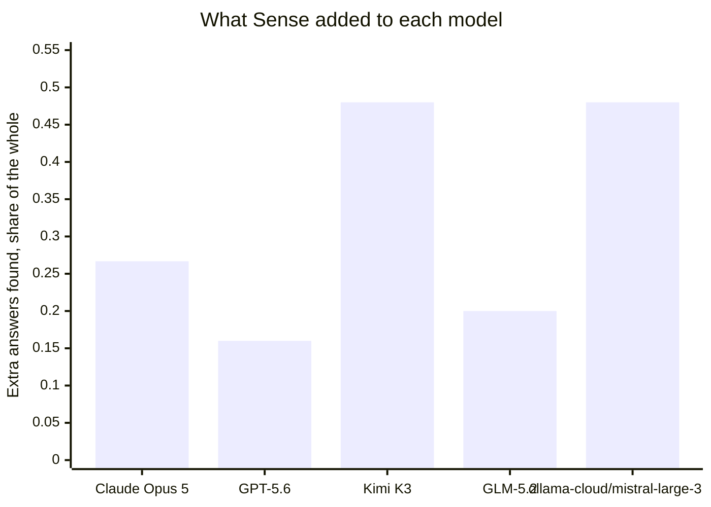
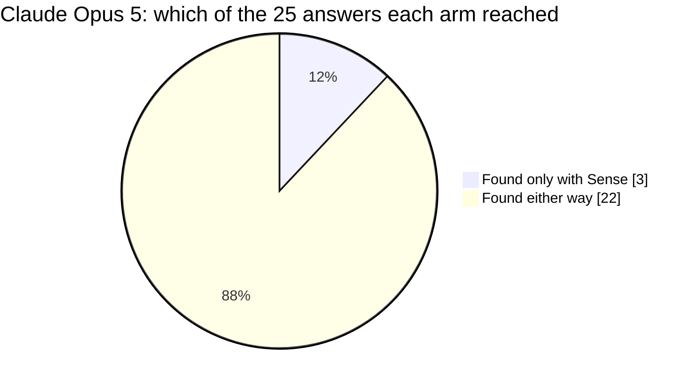
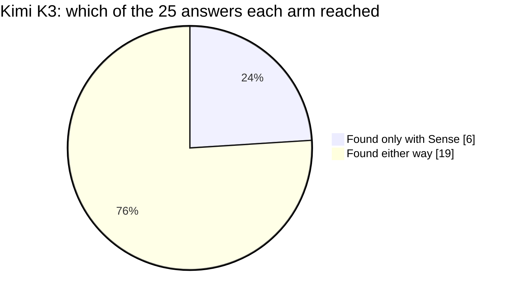
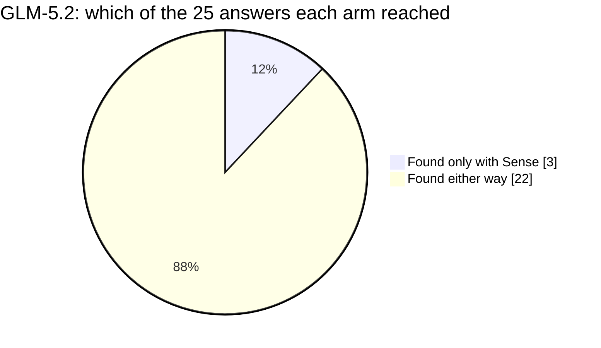
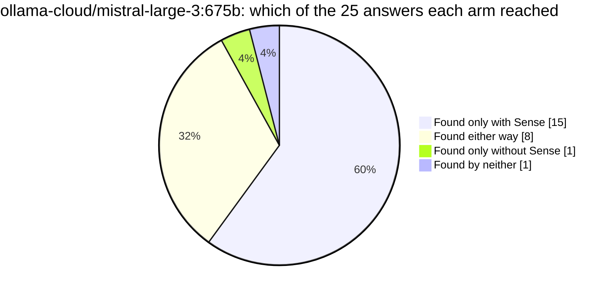
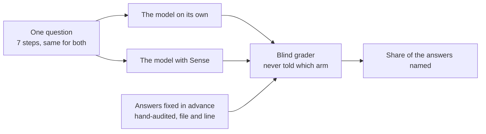

# Does Sense help an AI understand Rails?

Ruby on Rails itself: the web framework that runs a large share of the production web. One question about its code, put to 5 models twice each, with Sense and without.

## Reading

Auditing what depends on the query relation in Rails itself, every model reached answers with Sense that it never reached on its own in any run without it: 3 for Claude Opus 5, 6 for GPT-5.6, 6 for Kimi K3, 3 for GLM-5.2 and 15 for the mistral-large-3 arm, out of 25 answers fixed and hand-audited before anything ran. That is the result — not a higher score, but locations in the codebase the model did not otherwise get to. All 4 models we put the question to after the headline column actually queried Sense, and 2 of those 4 cleared the same bar the question was proved at; the other two are on the page as measured, with two runs that disagree. Cost went both ways: Kimi K3 moved 675,100 tokens working on its own and 640,263 with Sense, and on the one harness that clocks both arms the Sense session cost well under a minute of extra wall time. The largest gap here is our own consistency rather than the models': on GLM-5.2 all 25 answers came back from Sense in one run and not in another, and that column lands at 0.64 with Sense.

## At a glance

| model | on its own | with Sense | difference | found only with Sense | time with Sense |
|---|---|---|---|---|---|
| Claude Opus 5 | 0.71 | 0.97 | **+0.27** | **3** | 4.0 min |
| GPT-5.6 | 0.76 | 0.92 | **+0.16** | **6** |  |
| Kimi K3 | 0.38 | 0.86 | **+0.48** | **6** |  |
| GLM-5.2 | 0.44 | 0.64 | **+0.20** | **3** |  |
| ollama-cloud/mistral-large-3:675b | 0.26 | 0.74 | **+0.48** | **15** |  |

Share of the 25 hand-audited answers each model cited, working the same question. Read each row across, never down: a model is only ever compared to itself.

## The question

A maintainer is about to rework a central class in Rails and needs to know what depends on it before touching it. The answer is scattered across the codebase, so the work is finding all of it, not reasoning about any one piece.

The models were given no more than this framing, which deliberately never names the class: finding it is part of the task.

> You are a maintainer about to rework how the lazy query object that every finder, scope and association returns is built up, merged and executed. Before touching that contract, you need a complete audit of what depends on it today, so the rework does not silently break a dependent. Work through the tasks below one at a time; each builds on what you learned in the previous one. Keep every answer concrete with file:line so the next step (and a teammate opening the PR) can act without re-exploring the codebase.

The session is 7 steps, sent in order. Verbatim:

The full task, exactly as each model received it

**1. Orient in the codebase**

> Task: orient yourself. In a few sentences plus file paths, what is this project, how is the code organized, and where does the object you are about to rework sit, the lazy query value that a finder or scope or association returns and that accumulates a query as it is chained, along with the shared pieces it is built on? Hand the next agent a map so they can act with small, targeted lookups, not a fresh exploration of the codebase. No Explore agents.

**2. Map the Relation contract and what it is built on**

> Task: map the contract of the object you are about to change. What does it expose and what shared behavior is mixed into it (the query-building, finder, calculation, spawning and delegation modules that make up its query interface), and what does a teammate need to know about that contract before changing it? Give file:line for the relation object and each shared piece.

**3. Trace how a query is built up and executed**

> Task: trace how a query relation is created and run. Start from where a finder or scope hands back a relation, follow how chaining spawns a new relation and merges conditions, and end where the accumulated query is turned into SQL and executed. Give file:line for each layer and the order they run.

**4. Audit every dependent of the Relation contract**

> Task: this is the core of the ticket. Find EVERY place in the codebase that depends on the query relation object, so the rework cannot silently break one. Be exhaustive and group them by area (the query-building/finder/calculation modules that make up its interface; and — do not stop at the query directory — the call sites elsewhere that build, type-check, execute or extend a relation: connection role/shard execution, SQL bind-variable handling, collection cache keys, encrypted-query rewriting, signed-id finders, named-scope definition; and the OTHER gems that build on it, such as a core-extension that mirrors a relation method and the command-line query renderer). Many depend on it WITHOUT naming the class, reaching it by the short name, by building a relation, or by a `===`/case type test, so a search for the class name will miss them and the bare word is too noisy to grep across the query layer. For each dependent give file:line and one phrase on how it uses the relation. A missed dependent is a regression shipped.

**5. Trace how relation behavior is reused for associations**

> Task: an association's collection behaves like a relation. Trace how the association collection reuses the relation query interface (what it subclasses or delegates to) and where association queries are built. Give file:line throughout.

**6. Assess the blast radius of the contract change**

> Task: you are about to change the Relation contract (how a relation is spawned, merged and executed). Assess the full blast radius: which dependents are at risk, which are most likely to break, and what must be re-verified after the change, across every area you found including the scattered call sites and the other gems. Be complete and use file:line; rank by risk. A missed high-risk dependent is the one that pages someone.

**7. Produce the change + verification map**

> Task: produce the complete map for landing this safely: the relation object and shared query modules you will edit, every dependent that must be reviewed or touched grouped by area (including the scattered call sites and the cross-gem dependents), and the tests or fixtures that must be updated or added. Use file:line throughout, so a teammate could land the change from your map alone.

| | |
|---|---|
| repository | [Rails](https://github.com/rails/rails) |
| stack | Ruby on Rails |
| answers to find | 25, hand-audited |
| Sense build | sense 1.13.5 (schema v5, embeddings: all-MiniLM-L6-v2-ctx1) |
| question id | `sha256:3f210bcde96c18e1` |

## Model by model

### Claude Opus 5

Anthropic's Claude Opus 5, run through Claude Code.

**3 of the 25 answers this model never found on its own**, in either run without Sense, it found with Sense.

Sense put 24.3 of the 25 answers in front of it with exact locations, and the model used them.

- **on its own** 0.7067  ->  **with Sense** 0.9733   (**+0.2667**)
- **hardest group of answers** +0.5556
- **where the answers came from** Sense and used 24.3, Sense but unused 0.7, found without Sense 0, reached by neither 0
- **time** 3.3 min on its own, 4.0 min with Sense
- **tokens used** 571,183 on its own, 866,677 with Sense (everything the session moved, cached context included)
- **how it worked** 19 searches and 1 file read on its own; 7 Sense calls, 8 searches and 1 file read with Sense
- **time allowed** 480s with Sense, 440s without, the second derived from the first so the question is "given the time it takes WITH Sense, can you get there without it"
- **runs** 3 without Sense, 3 with, carried over from the run that first proved this question

Across this model's runs, 2 answers came back from Sense one time and not the other. We track that as a determinism issue and it is ours to close.

### GPT-5.6

OpenAI's GPT-5.6, run through the Codex CLI.

**6 of the 25 answers this model never found on its own**, in either run without Sense, it found with Sense.

Sense put 22.5 of the 25 answers in front of it with exact locations, and the model used them.

- **on its own** 0.7600  ->  **with Sense** 0.9200   (**+0.1600**)
- **hardest group of answers** +0.4444
- **where the answers came from** Sense and used 22.5, Sense but unused 2, found without Sense 0.5, reached by neither 0
- **tokens used** 400,890 on its own, 452,528 with Sense (everything the session moved, cached context included)
- **how it worked** 8 searches and 0 file reads on its own; 23 Sense calls, 3 searches and 0 file reads with Sense
- **time allowed** 600s with Sense, 304s without, the second derived from the first so the question is "given the time it takes WITH Sense, can you get there without it"
- **runs** 2 without Sense, 2 with, benched for this board

Across this model's runs, 5 answers came back from Sense one time and not the other. We track that as a determinism issue and it is ours to close.

### Kimi K3

Moonshot AI's Kimi K3 coding model, run through opencode.

**6 of the 25 answers this model never found on its own**, in either run without Sense, it found with Sense.

This model's two runs tell different stories, so the board does not call it either way until a third run rules.

- **on its own** 0.3800  ->  **with Sense** 0.8600   (**+0.4800**)
- **hardest group of answers** +0.5714
- **where the answers came from** Sense and used 11, Sense but unused 0, found without Sense 10.5, reached by neither 3.5
- **tokens used** 675,100 on its own, 640,263 with Sense (everything the session moved, cached context included)
- **how it worked** 31 searches and 21 file reads on its own; 2 Sense calls, 20 searches and 6 file reads with Sense
- **time allowed** a fixed ceiling for both arms (opencode: the larger of 1200s, or 3000s for Kimi, and the repo's own)
- **runs** 2 without Sense, 2 with, benched for this board

Across this model's runs, 16 answers came back from Sense one time and not the other. We track that as a determinism issue and it is ours to close.

### GLM-5.2

Z.ai's GLM-5.2, run through opencode.

**3 of the 25 answers this model never found on its own**, in either run without Sense, it found with Sense.

This model's two runs tell different stories, so the board does not call it either way until a third run rules.

- **on its own** 0.4400  ->  **with Sense** 0.6400   (**+0.2000**)
- **hardest group of answers** +0.3333
- **where the answers came from** Sense and used 14.7, Sense but unused 6.3, found without Sense 1.3, reached by neither 2.7
- **tokens used** 4,713,436 on its own, 2,715,411 with Sense (everything the session moved, cached context included)
- **how it worked** 28 searches and 46 file reads on its own; 3 Sense calls, 15 searches and 46 file reads with Sense
- **time allowed** a fixed ceiling for both arms (opencode: the larger of 1200s, or 3000s for Kimi, and the repo's own)
- **runs** 2 without Sense, 3 with, benched for this board

Across this model's runs, 25 answers came back from Sense one time and not the other. We track that as a determinism issue and it is ours to close.

### ollama-cloud/mistral-large-3:675b

**15 of the 25 answers this model never found on its own**, in either run without Sense, it found with Sense.

Sense put 18 of the 25 answers in front of it with exact locations, and the model used them. 6 more were returned by Sense and did not make it into the answer. That one is ours: the information arrived in a shape this model did not carry through.

- **on its own** 0.2600  ->  **with Sense** 0.7400   (**+0.4800**)
- **hardest group of answers** +0.6667
- **where the answers came from** Sense and used 18, Sense but unused 6, found without Sense 0.5, reached by neither 0.5
- **tokens used** 567,590 on its own, 571,786 with Sense (everything the session moved, cached context included)
- **how it worked** 2 searches and 10 file reads on its own; 13 Sense calls, 0 searches and 9 file reads with Sense
- **time allowed** a fixed ceiling for both arms (opencode: the larger of 1200s, or 3000s for Kimi, and the repo's own)
- **runs** 2 without Sense, 2 with, benched for this board

Across this model's runs, 10 answers came back from Sense one time and not the other. We track that as a determinism issue and it is ours to close.

## Does it hold across models

2 of the 4 models that actually queried Sense cleared the same bar the question was proved at: **Kimi K3**, **ollama-cloud/mistral-large-3:675b**.

## What this is, and what it is not

This is a measurement of **Sense**, run on one question against one repository, with each model answering twice with Sense available and twice without.

It is **not a comparison of the models**. Each one runs on its own harness with its own budget and its own defaults, so their scores are not comparable to each other and are never presented that way here.

**The arms are not all given the same clock**, and each column says what it got. The Claude harness runs Sense first and then gives the no-Sense arm the time Sense took plus a margin, which asks whether the same ground is reachable without the tool. The other harnesses give both arms one fixed ceiling, and that ceiling is larger. A longer clock helps the arm WITHOUT Sense, so those columns are the harder test, not the easier one.

It is **not a comparison of the repositories** either. Questions are written per repository and hand-audited per repository; a number from one page does not rank against a number from another.

How a number here is produced:

The answers were fixed in advance: 25 locations, audited by hand before any model ran, and a model is credited only when it names the file and the line. Grading is done by a separate pinned model that is never told which arm or which model produced an answer.
